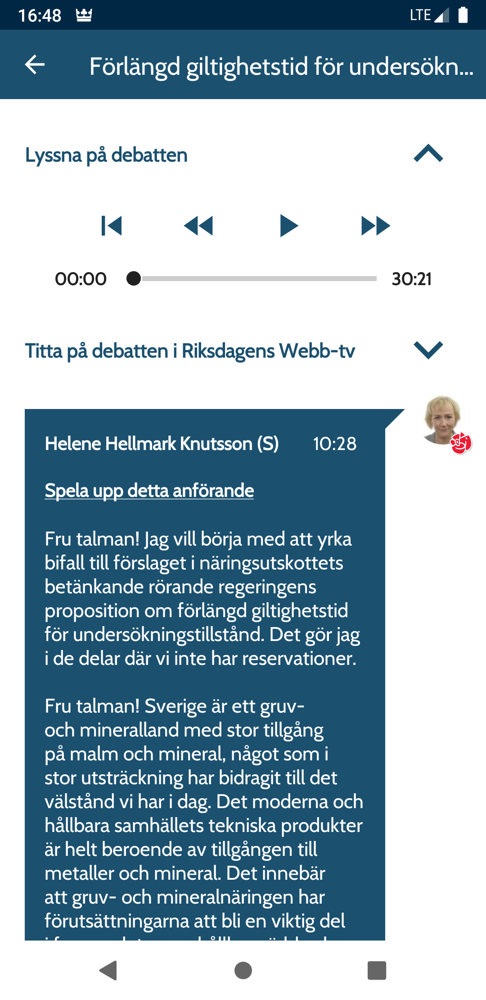
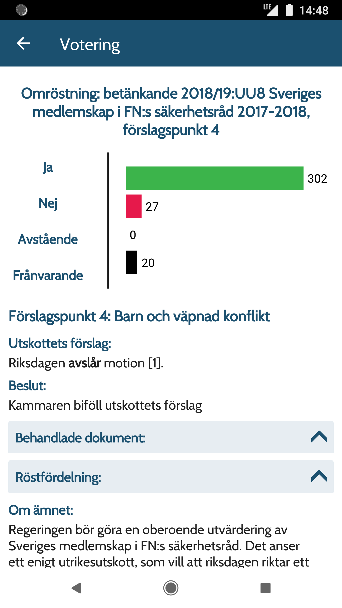
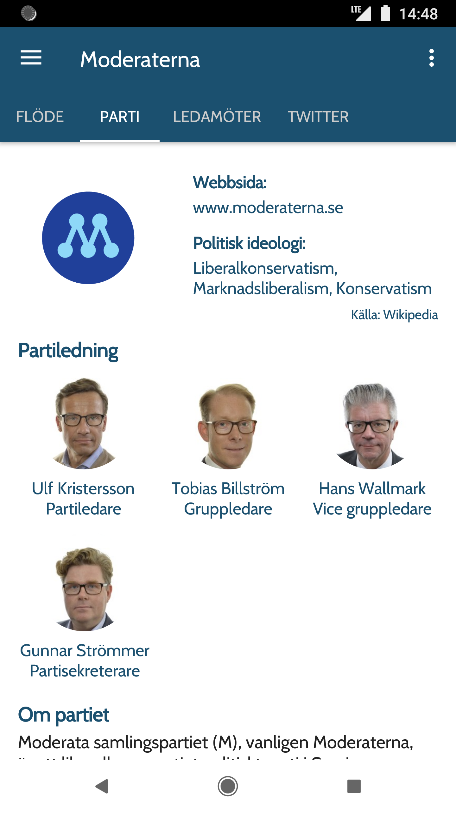
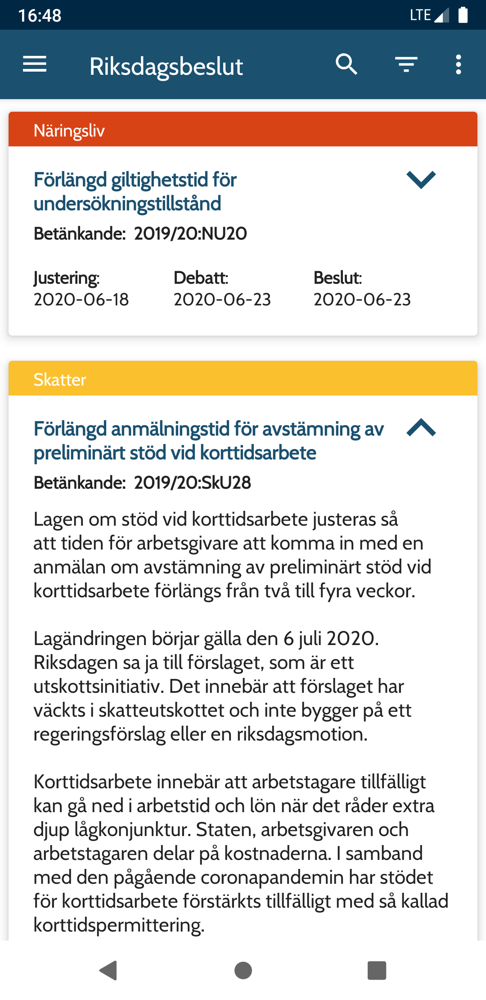
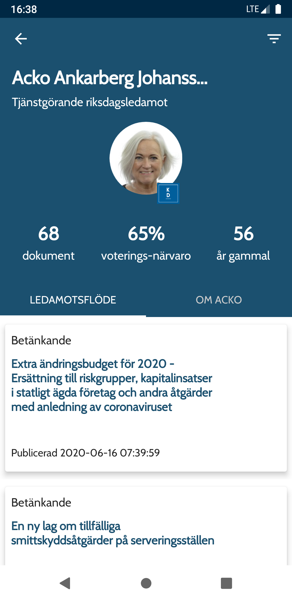
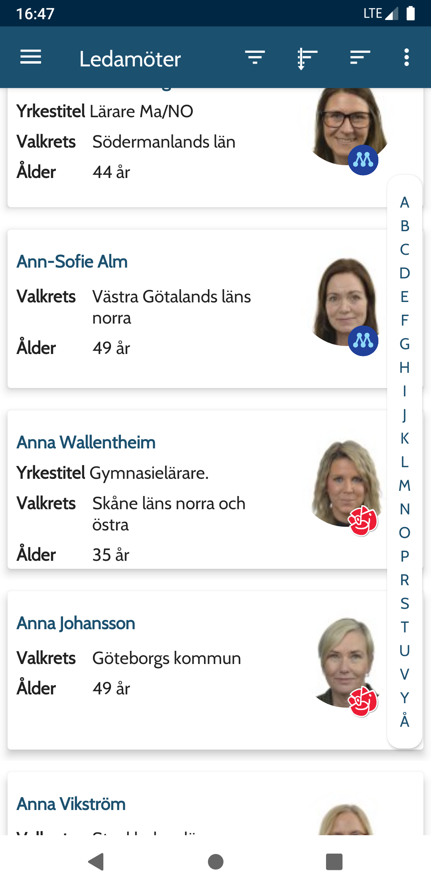

## This reposotory is no longer maintained. 

Due to limited time and not being able to keep up with breaking changes in the api, in the current state the app is no longer 100% functional. 

# Riksdagskollen
Android app to keep track of the Swedish parliament.

## Features:
 * View new decisions made by the parlament.
 * View the results of votes.
 * Sort by party.
 * Read new questions, motions and other documents put forward by the parties.

## Screenshots:
 
 

